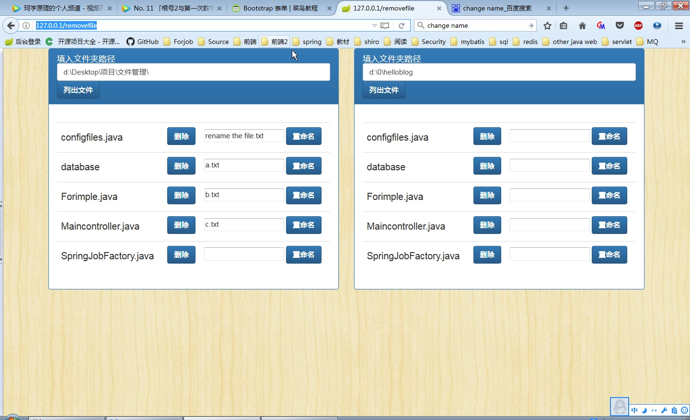

## 应用名称
Filemanager

## 技术栈	
	JDk8
	Spring
	Spring boot
	Bootstrap3
	Freemarker

## 功能介绍
简单的基于web的文件管理应用，提供双面板和文件删除，以及文件重命名功能，有点类似与Windows的Total commander

## 快速开始
* 本程序为maven项目，所有首先需要下载和配置好maven。http://maven.apache.org/download.cgi
* 返回本程序项目主页点击右上角按钮进行下载
* 解压项目
* 使用命令 mvn clean package构建项目
* 构建完成后一般在target\目录下会得到一个jar包，运行该jar包即可

## 应用截图

